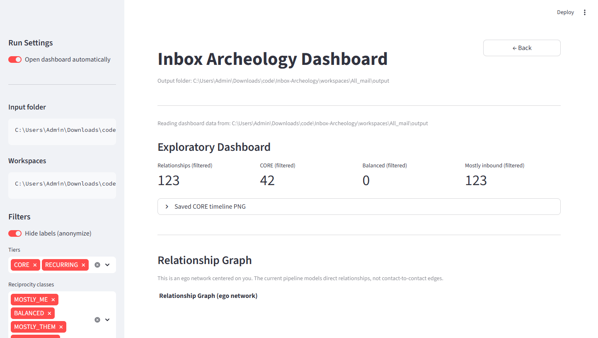
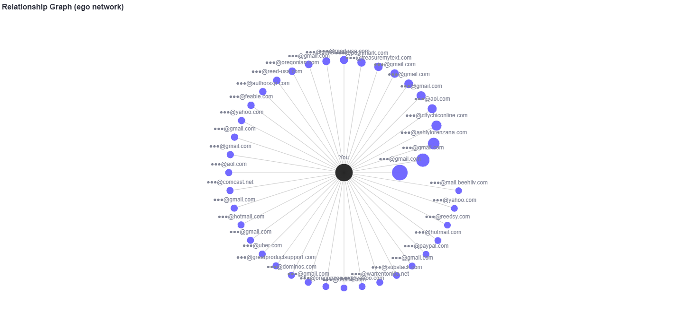
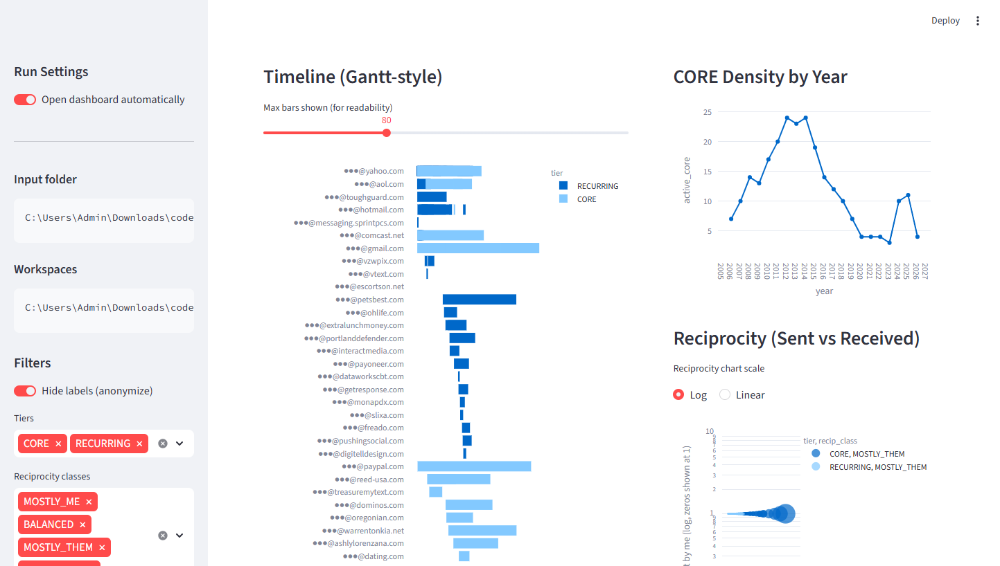

# Inbox Archeology

Explore your exported message data like a personal time machine.

---

## Preview

### Dashboard


### Relationship Graph


### Analytics


---

## What this is

Inbox Archeology transforms your Google Takeout data into a searchable, visual archive.

- Fully local
- Privacy-first
- Designed for exploration, not just storage

---

## Quick Start

```bash
git clone https://github.com/monapdx/Inbox-Archeology.git
cd Inbox-Archeology
npm install
npm run dev
```

---

## Get Involved

👉 Check out the Issues tab and CONTRIBUTING.md to get started

---

## Philosophy

This project is part of a broader movement toward:

- Data portability  
- Digital sovereignty  
- Personal archives  

Your data should belong to you.
